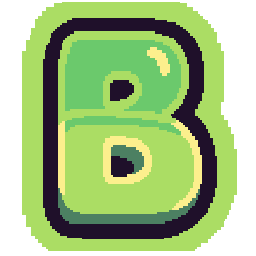

<p align="center">
  
</p>

# Battlemon

[](https://github.com/remarkablegames/battlemon/releases)
[](https://github.com/remarkablegames/battlemon/actions/workflows/build.yml)

⚔️ <kbd>Battlemon</kbd> is an autobattler where you tame, fight, and level up your monsters.

Play in your browser:

- [itch.io](https://remarkablegames.itch.io/battlemon)
- [Wavedash](https://wavedash.com/games/battlemon)
- [remarkablegames](https://remarkablegames.org/battlemon/)

Or download for desktop:

- [Windows](https://github.com/remarkablegames/battle-monster/releases/latest/download/windows.zip)
- [macOS](https://github.com/remarkablegames/battle-monster/releases/latest/download/macos.zip)
- [Linux](https://github.com/remarkablegames/battle-monster/releases/latest/download/linux.zip)

Read the [blog post](https://remarkablegames.org/posts/battlemon/).

## How to Play

- **Fight** — monsters auto-attack and fire special moves on their own. Your job is to manage the battle.
- **Swap** — tap a monster on the bench to swap the active monster with a 3-second cooldown. Benched monsters regenerate HP during battle.
- **Items** — buy potions, full restores, revives, and temporary battle boosters to use mid-fight. Purchase XP boosters to level up your monster.
- **Tame** — after each victory, tame 1 defeated enemy to add to your team.
- **Level Up** — monsters earn XP for participating in battle. On level-up, the monster fully heals and increases its stats.

## Features

- 🎮 **Starter choice** — pick 1 out of 3 monsters and preview your enemies before the battle.
- ⚔️ **Real-time autobattler** — monsters automatically attack and activate special abilities; swap between monsters and use items mid-fight.
- 🧬 **6 monster types** (_Fire_, _Water_, _Plant_, _Electric_, _Earth_, _Air_) with a rock-paper-scissors type-effectiveness chart (1.5× strong, 0.5× weak) and crit attacks (15% chance, 1.5× damage).
- 🎭 **6 personalities** (_Brave_, _Timid_, _Sturdy_, _Swift_, _Calm_, _Fierce_) that bias a monster's stats, making every monster unique.
- 🏋️ **Leveling & XP** — monsters earn XP for participating in battle; on level up, the monster fully heals and increases its stat.
- 🪤 **Taming** — after each victory, tame 1 defeated enemy.
- 🛒 **Shop** — spend coins on potions, full restores, revives, battle boosters (_Enrage_, _Iron Skin_, _Haste_, _Enemy Debuff_), and +100 XP boosts; sell monsters for coins.
- 🌊 **Endless waves** — permadeath runs with rising difficulty as waves grow.

## Credits

### Art

- [Dino Characters](https://arks.itch.io/dino-characters) by [@ArksDigital](https://twitter.com/ArksDigital)
- [Free Tiny Hero Sprites Pixel Art](https://free-game-assets.itch.io/free-tiny-hero-sprites-pixel-art)
- [Free Pixel Predator Plant Mob Sprites](https://free-game-assets.itch.io/free-predator-plant-mobs-pixel-art-pack)
- [Free Slime Mobs Pixel Art](https://free-game-assets.itch.io/free-slime-mobs-pixel-art-top-down-sprite-pack)
- [KAPLAY Crew](https://kaplayjs.com/crew/)

### Audio

- [xDeviruchi - 8-bit Fantasy & Adventure Music](https://xdeviruchi.itch.io/8-bit-fantasy-adventure-music-pack)
- [Pixel UI Sound Effects by Atelier Magicae](https://ateliermagicae.itch.io/pixel-ui-sound-effects)
- [FilmCow Royalty Free Sound Effects Library](https://filmcow.itch.io/filmcow-sfx)
- [Sound effects from Pixabay](https://pixabay.com/sound-effects/)

## Prerequisites

[nvm](https://github.com/nvm-sh/nvm#installing-and-updating):

```sh
brew install nvm
```

## Install

Clone the repository:

```sh
git clone https://github.com/remarkablegames/battlemon.git
cd battlemon
```

Install the dependencies:

```sh
npm install
```

## Environment Variables

Update the environment variables:

```sh
cp .env .env.local
```

Update the **Secrets** in the repository **Settings**.

## Available Scripts

In the project directory, you can run:

### `npm start`

Runs the game in the development mode.

Open [http://localhost:5173](http://localhost:5173) to view it in the browser.

The page will reload if you make edits.

You will also see any errors in the console.

### `npm run build`

Builds the game for production to the `dist` folder.

It correctly bundles in production mode and optimizes the build for the best performance.

The build is minified and the filenames include the hashes.

Your game is ready to be deployed!

### `npm run bundle`

Builds the game and compresses the contents into a ZIP archive in the `dist` folder.

Your game can be uploaded to your server, [itch.io](https://itch.io/), etc.

## Testing

For testing, you can use querystring parameters to jump directly to specific scenes and override game state:

- `?scene=shop` — jump directly to the shop scene
- `?scene=shop&coins=100` — shop with 100 coins
- `?scene=waveStart&wave=5` — wave start at wave 5
- `?team=3` — generate a random team of 3 monsters (1-6 supported)
- `?team=3&scene=battle&wave=5` — battle with 3 random monsters at wave 5

## License

[MIT](LICENSE)
